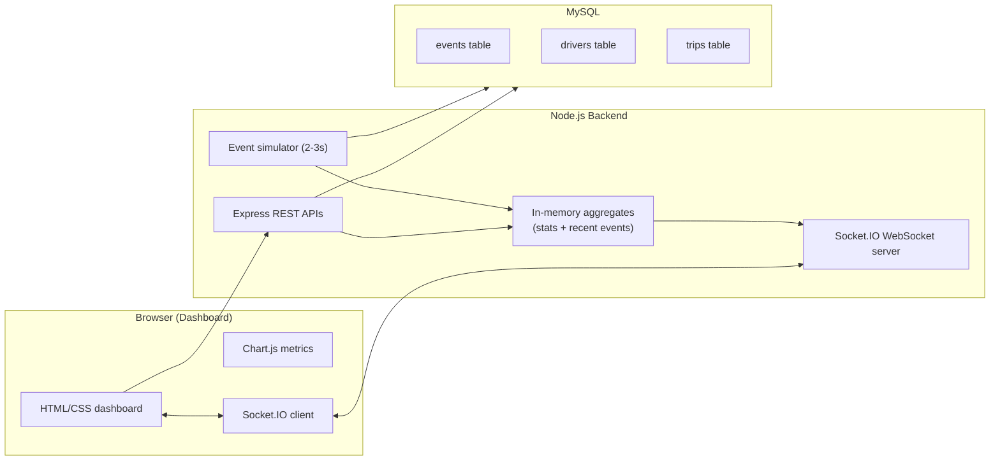

# Architecture - okDriver Fleet Monitoring Prototype

This prototype simulates a production-style **fleet monitoring platform** with a small but realistic architecture.

## High-Level Overview

- **Backend**: Node.js + Express + Socket.IO + MySQL (via `mysql2`).
- **Frontend**: Static HTML/CSS/JS dashboard using Chart.js and Socket.IO client.
- **Realtime**: WebSocket-based push (Socket.IO) for metrics and events.
- **Data**: In-memory aggregates for fast dashboard updates, with optional MySQL persistence.

## Backend Components

**File:** `server/index.js`

- Configures **Express** for REST APIs (`/api/health`, `/api/stats`, `/api/events`, `/api/events/recent`).
- Serves the static frontend from `public/`.
- Initializes **Socket.IO** and listens for client connections.
- Maintains an in-memory `state` object:
  - `totalTrips` – simulated trips.
  - `liveDrivers` – drivers active in the last 20 seconds.
  - `violationCount` – cumulative violations.
  - `riskScore` – overall risk score.
  - `lastEvents` – rolling window of most recent events.
  - `activeDrivers` – map of driver → last activity timestamp.
  - `driverViolations` – map of driver → violation count (used for “3 violations in a trip” rule).

**File:** `server/simulator.js`

- Generates synthetic driver events every **2–3 seconds**:
  - Random driver and event type (`speeding`, `harsh_braking`, `drowsiness`).
  - Random speed between 50 and 110 km/h.
- Applies business rules:
  - Speed > 80 km/h → marked as a **violation**; used to trigger **red alert card** on the frontend.
  - All violations increment `violationCount` and increase `riskScore`.
  - Every **3rd violation for a driver** triggers an extra risk bump to simulate “3 violations in one trip”.
- Updates the in-memory `state`.
- Broadcasts:
  - Individual `event` payload to all WebSocket clients.
  - Updated `stats_update` payload to all clients.

**File:** `server/mysql.js`

- Configures a **MySQL connection pool** using environment variables:
  - `MYSQL_HOST`, `MYSQL_PORT`, `MYSQL_USER`, `MYSQL_PASSWORD`, `MYSQL_DATABASE`.
- Exposes:
  - `initDb()` – initializes the pool and runs a `SELECT 1` sanity check.
  - `getPool()` – returns the configured pool (or throws if not initialized).
- If environment variables are missing, the backend logs a warning and runs in **demo mode** with **in-memory** data only.

**MySQL Schema:** `schema.sql`

- Creates three tables:
  - `drivers` – driver master data.
  - `trips` – trip metadata (start/end).
  - `events` – all events with type, speed, timestamps, and violation flag.

## Frontend Components

**File:** `public/index.html`

- Defines the dashboard layout:
  - **Header** with connection status pill.
  - **Metric cards** for total trips, live drivers, violations, risk score.
  - **Live dashcam feed** via an embedded YouTube iframe.
  - **Events by type** bar chart (Chart.js).
  - **Recent events** table.
  - **Alert banner** used for red alert and risk alerts.
- Loads:
  - `styles.css` for UI.
  - CDN builds of **Chart.js** and **Socket.IO client**.
  - `app.js` for dashboard logic.

**File:** `public/styles.css`

- Implements a modern, dark, glassmorphism-inspired UI:
  - Responsive grid layout for metrics and panels.
  - Sticky table header for recent events.
  - Color-coded **badges** and **alert banners**.
  - Adaptive behavior for tablet and mobile breakpoints.

**File:** `public/app.js`

- On load:
  - Fetches initial `/api/stats` and `/api/events/recent`.
  - Bootstraps the **Chart.js** bar chart (events per type).
  - Connects to the Socket.IO endpoint.
- WebSocket handlers:
  - `stats_update` – updates metric cards in real time.
  - `events_snapshot` – fills the initial recent events table.
  - `event` – appends new events to the table, updates the chart, and triggers alerts.
- Alert logic:
  - If `type === "speeding"` and `speed > 80`, shows a **red alert card** message.
  - For other violations, shows a softer **risk alert**.

## Data Flow

1. **Simulator / Manual Ingestion**
   - Simulator generates an event every 2–3 seconds, or an operator posts an event via `POST /api/events`.
2. **Backend Processing**
   - Backend normalizes the event, updates in-memory aggregates and (optionally) persists to MySQL.
3. **Realtime Push**
   - Backend emits `event` + `stats_update` via Socket.IO.
4. **Dashboard Update**
   - Browser receives events and:
     - Updates metric cards.
     - Adds a row to the recent events table.
     - Updates the Chart.js bar chart.
     - Shows red/risk alerts based on business rules.

